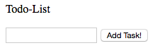
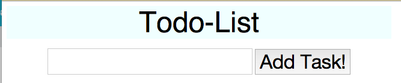
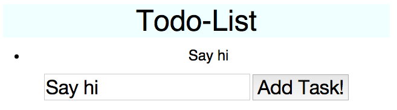

How to Build a Very Basic Todo-list
===================================

This article extends what's been taught in the Code4HK JavaScript Ignite! course and supplements knowledges necessary for building a Todo-list with only one functionality: adding tasks.

I'm a total beginner myself. Therefore mistakes are probably somewhere to be found. Please feel free to raise issue or comment.

Step 1: Clarify the Requirements
--------------------------------

Here are what we want:

1. a web todo-list that runs in the browser, and

2. the user may add tasks represented by text.

Here are what we don't need at the moment:

1. the app doesn't need to save the tasks for the long term, even if a refresh will wipe out everything;

2. it doesn't have to be able to remove items from the list; and

3. it doesn't need to be pretty.

Step 2: Plan the Outline
------------------------

We'll need three files:

1. **index.html**, which contains the structure of the page;

2. **style.css**, which make the page look nicer; and

3. **main.js**, which allows the user to add and remove tasks.

Step 3: Build the structure with index.html
-------------------------------------------

Let's begin with the HTML. We like to have three parts for the web page:

1. A header, which shows the title;

2. A main section, which contains the task-list; and

3. A footer, which contains a input-field and a button.

The HTML code should be similar to this:

```
<!DOCTYPE html>
<html>

	<head>
		<title>Todo-List</title>
		<link type='text/css' rel='stylesheet' href='style.css' />
	</head>

	<body>

		<header>Todo-List</header>

		<div id='main_section'>
			<ul id='task_list'> <!-- New task items will go here -->
			</ul>
		</div>

		<footer>
			<input id="task_input" />
			<button id="btn_add_task">Add Task!</button>
		</footer>

	<script src="main.js"></script>
	</body>

</html>
```

If you are not familiar with how HTML works, you can just open a text-editing tool,
copy-and-paste the content above, and save it as **index.html**.

Open the **index.html** in a browser, and it looks like:



Step 4: Make it look nicer with style.css
------------------------------------------

Let's make the page look a little bit more polished with a stylesheet.

Did you notice that in the head element of **index.html**, we linked a **style.css**?
That file didn't exist yet, until we create it now, with something like this:

```
body {
    font-size: 16px;
    text-align: center;
    font-family: "Helvetica", "Helvetica Neue", "Arial", sans-serif;
    width: 640px; /* px means pixels */
}

header {
    background-color: azure;
    font-size: 3em;
}

li { /* list items */
    font-size: 1.5em;
    line-height: 1.2;
}

input, button {
    font-size: 2em;
}
```

CSS semantics are quite similar to English, so you may be able to guess what these code means.

After adding the **style.css** file, your **index.html** should look like this somewhat better-looking version:



Step 5: Make it work by adding main.js
--------------------------------------

This is the truly important step. Right now, our "todo-list" has a button saying "Add Task!", but it 
doesn't do anything when you press it. We are about to change that.

In the line before </body> in **index.html**, we have referenced a script called **main.js**. This is the
JavaScipt file that's going to bring life to our web page.

Before we get down to coding, let's delineate how JavaScript and HTML interacts. Basically, HTML is like
a tree, as in a family free:
The <HTML> tag is the root, or great-great-parent, of all other elements in the document;
HTML has two "branches", or children, i.e., <head> and <body>;
then <head> has its own children, and so does <body>.

When the browser loads the **index.html**, it'll notice the **main.js** reference near the end.
And in that JavaScript file, the HTML is represented as an object named "document".
We can modify our web-page by operating on this "document" object.

So, let's implement the "add task" functionality. Specifically, we want that:
- When the "Add Task!" button is clicked,
- An list item is added to the task_list, and
- The list item should have the text in the task_input.

Now create a main.js under the same folder as index.html, and translate what we want into JavaScript:

```
/* Define the names of the elements we need */
var task_list = document.getElementById('task_list');
var task_input = document.getElementById('task_input');
var btn_add_task = document.getElementById('btn_add_task');

/* Define what happens when the button is clicked */
btn_add_task.onclick = function () {
    var newTaskText = task_input.value;
    var textNode = document.createTextNode(newTaskText);
    var newTaskListItem = document.createElement('li');
    newTaskListItem.appendChild(textNode);
    task_list.appendChild(newTaskListItem);
};
```

Here is what we told the browser to do:
When the button is clicked, save the content of the input field as newTaskText;
Then, create a textNode and fill it with the content of the input field, and also create a list item;
After that, attach the textNode to the list item, and the list item to the task list.

At that point, we achieve what we want: adding a new task to the task list.

Why do we need to create the textNode? Because for technical reasons, we can't simply attach string variables
to the elements. We need to first create a node containing the text, then assign it to the list items.



So, What's Next?
----------------
This todo-list is not very useful. There are many ways to improve it, such as:

1. adding functionality to remove items;

2. not adding a item if the input field is empty when the button is pressed;

3. automatically checking duplicates;

4. making it visually pleasing;

5. adding a back-end stack so that our todo list remembers the task for later use;

6. adding password mechanism;

etc.

I shall keep working on it as an exercise. You could watch the project at:
[GitHub](https://github.com/andyshuxin/todo-list).

Please feel free to comment or ask questions here on GitHub or via Email at andy@shux.in or via Code4HK Slack channel.
